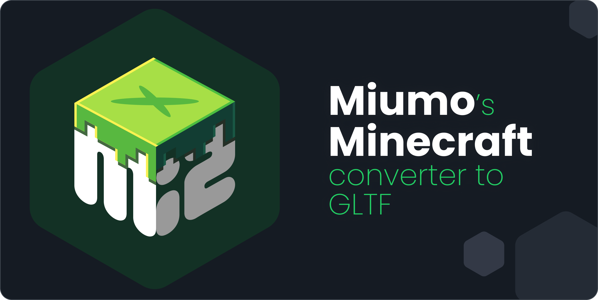

> **Mi<sup>2</sup> Gltf** is a very lightweight converter written in Java intended to convert from Minecraft models to GTLF files.

##### Table of Contents
- [Setup](#setup)
- [Convert](#convert)
- [Future](#future)


## Setup
<a name="setup"></a>
This converter is written in Java 17. It can be added to your project using Maven:
```xml
<dependency>
    <groupId>io.github.mrmiumo</groupId>
    <artifactId>mi2engine</artifactId>
    <version>1.0.0</version>
</dependency>
```
Once imported in your project, simply call the converter with a model path within a valid Minecraft resources pack. It is recommended to have the default minecraft textures in a spare folder (more info bellow).

## Convert
<a name="convert"></a>
This technique enabled you to have full control over what is used to generate your images. It is adapted when no tool already exist for your use case.</br>
Here is a small example:

```java
/* Step 1. Get the path pointing to your model */
var model = Path.of("assets/minecraft/models/item/photograph.json");

/* Step 2. Call the GLTF builder */
var gltf = GltfBuilder.from(model);

/* Step 3. Save to a file */
gltf.save(Path.of("photograph.gltf"));
```

### Pretty printing
If needed for debugging, code analysis or anything else, pretty json formatting can be enabled before saving the file by calling:
```java
gltf.prettify();
```
Note that a prettified file is slightly larger than a standard one!

### Default textures
A lot of models actually relies on Minecraft default textures. Those are not embedded in this converter and must be linked manually.
- **Option 1** - Add the `default.minecraft.pack` property in your `application.properties` file located in the resources folder. The given values points to the main folder of the default pack.
- **Option 2** - Call `GltfBuilder.setDefaultPack()` with the path of your default pack before calling the converter.

**Download**<br>
While it is possible to find some on internet, the most reliable way of getting the default pack is to extract it from Minecraft directly:
- Start at least one time the game with the version to want to use models with
- Go to `%appdata%/.minecraft/versions` and opens the directory that matches you version
- Open the `.jar` file with 7Zip or change its extension by `.zip` and extract its content
- Get the `assets` folder and paste it wherever you want: that's the default resources pack!


## Future
<a name="future"></a>
*Or what Mi²Gltf can't do yet*
<br>
- **GTB** - It will come one day!
- **Game Compatibility** - So fare, the converter have only been tester with models from `1.20.4`. Compatibility with other versions is not guaranteed, but feel free to report any error!
- **Animated models** - Only the first frame of each animation is supported yet.